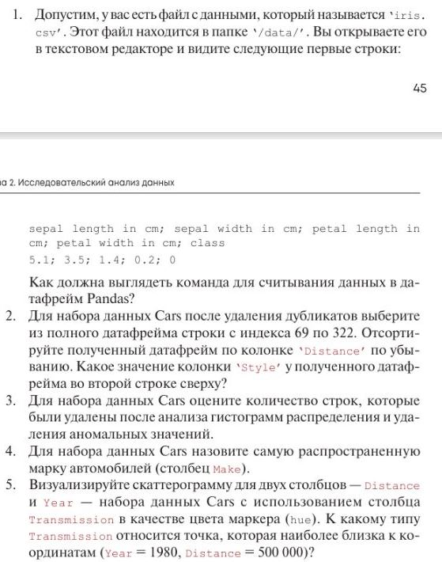
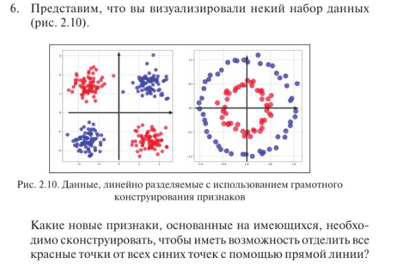

# Контрольные вопросы №2
  
  
1. Для считывания данных из файла 'iris.csv' в датафрейм pandas, можно использовать функцию read_csv() из библиотеки pandas. Необходимо учитывать что разделителем является точка с запятой ";"  
 **Загрузка данных из файла и указание пути к файлу**
```
import pandas as pd
data_path = '/data/' 
file_name = 'iris.csv'
iris_data = pd.read_csv(data_path + file_name, sep=';')
```
В последней строке кода указано, что точка с запятой является разделителем данных, через команду read осуществляется  
чтение.  
2.  
```
import pandas as pd

 Загрузка данных
data = pd.read_csv('Cars.csv')

 Удаление дубликатов
data = data.drop_duplicates()

 Выбор нужных строк и создание нового датафрейма
new_data = data.iloc[69:323]

 Сортировка датафрейма по колонке 'Distance' по убыванию
new_data = new_data.sort_values('Distance', ascending=False)
Получение значения 'Style' во второй строке сверху
style_value = new_data.iloc[1]['Style']

print(style_value)
```
3. 
Сначала импортируем библиотеки pandas и matplotlib. Затем загружаем данные из файла 'cars.csv' в DataFrame с помощью функции pd.read_csv(). Построем гистограммы для интересующих столбцов, используя метод hist() DataFrame. После анализа гистограмм, установливаем критерии для исключения аномальных значений. В данной нам, отфильтруем строки, у которых цена ('price') выше 100000. Далее подсчитываем количество удаленных строк, вычтя длину обновленного DataFrame из длины исходного DataFrame.
```
import pandas as pd
import matplotlib.pyplot as plt

# Загрузка данных в DataFrame
data = pd.read_csv('cars.csv')

# Построение гистограмм для каждого интересующего столбца
data.hist()
plt.show()

# Определение критериев для исключения аномальных значений
# Например, отфильтруем строки, у которых цена ('price') выше 100000
updated_data = data[data['price'] < 100000]

# Подсчет количества удаленных строк
rows_deleted = len(data) - len(updated_data)
print("Количество удаленных строк:", rows_deleted)
```
