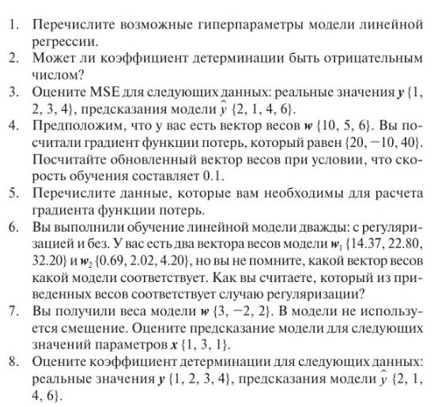

# Лабораторная работа №3
  

1.  
Гиперпараметры модели линейной регрессии:

Регуляризация (regularization): Гиперпараметры, связанные с регуляризацией, помогают предотвратить переобучение модели. Например, это может быть коэффициент L1 или L2 регуляризации, который определяет силу регуляризации.  
Обучающая выборка (training set) и тестовая выборка (testing set): Разделение данных на обучающую и тестовую выборки позволяет оценить производительность модели на независимых данных. Размеры обучающей и тестовой выборок могут быть гиперпараметрами.
Метод оптимизации (optimization method): В линейной регрессии можно использовать различные методы оптимизации, такие как стохастический градиентный спуск (SGD), обычный градиентный спуск (GD) или алгоритм Ньютона. Выбор метода оптимизации и его параметров, таких как скорость обучения (learning rate), может быть гиперпараметром.  
Функция потерь (loss function): В линейной регрессии обычно используется среднеквадратичная ошибка (MSE) в качестве функции потерь. Однако, в зависимости от задачи, можно использовать и другие функции потерь, такие как абсолютная ошибка (MAE) или гиперпараметр может определять выбор конкретной функции потерь.  
Размер партий (batch size): Если используется стохастический градиентный спуск или мини-пакетный градиентный спуск, гиперпараметром может быть размер партий (batch size), который определяет количество образцов, используемых для вычисления градиента на каждой итерации.  
Количество эпох обучения (number of epochs): Гиперпараметр, определяющий количество проходов модели над обучающими данными. Часто используется для контроля процесса обучения и предотвращения переобучения.  


2.  
Коэффициент детерминации (R-квадрат) может быть отрицательным числом. Коэффициент детерминации измеряет, насколько хорошо линейная регрессия соответствует данным и представляет собой значение от 0 до 1. Однако, в некоторых случаях, когда модель не соответствует данным лучше, чем простое предсказание среднего значения, R-квадрат может быть отрицательным числом.  
Отрицательное значение R-квадрата указывает на то, что модель не предсказывает данные лучше, чем простое среднее значение.  
Отрицательное значение R-квадрата указывает на неудачную модель и требует дополнительного анализа и корректировки модели или данных.

3.

Для оценки среднеквадратичной ошибки (MSE) нам нужно вычислить квадрат разности между фактическими значениями и предсказанными, затем усреднить эти значения.

Фактические значения [1,2,3,4]  
Предсказанные значения [2,1,4,6]  

Шаг 1: Вычислим квадраты разностей между фактическими и предсказанными значениями.  
(2 - 1)^2 = 1^2 = 1  
(1 - 2)^2 = (-1)^2 = 1  
(4 - 3)^2 = 1^2 = 1  
(6 - 4)^2 = 2^2 = 4  

Шаг 2: Суммируем квадраты разностей.  
1 + 1 + 1 + 4 = 7

Шаг 3: Разделим сумму на количество элементов (n = 4), чтобы получить среднее значение.  
MSE = 7 / 4 = 1.75


4.  
```
# Подключаем библиотеку numpy для работы с массивами
import numpy as np

# Текущие веса
w_old = np.array([10, 5, 6])

# Градиент
gradient = np.array([20, -10, 40])

# Скорость обучения
learning_rate = 0.1

# Обновление весов
w_new = w_old - learning_rate * gradient

print("Обновленный вектор весов:", w_new)
Обновленный вектор весов: [8. 6. 2.]
```

5.

- Функция потерь.  
- Вектор весов.  
- Входные и целевые данные.  
- Параметры модели (признаки, регуляризация).

6.

Вектор весов {0.69, 2.02, 4.20} скорее всего соответствует модели с регуляризацией, т.к его значения меньше, что характерно для регуляризации, которая стремится уменьшить веса модели.
Регуляризация, как правило, нацелена на снижение абсолютных значений весов модели с целью предотвращения чрезмерного приспособления к данным.  

7. 
```
import numpy as np

# Веса модели
w = np.array([3, -2, 2])

# Значения параметров
x = np.array([1, 3, 1])

# Используем функцию np.dot() для вычисления скалярного произведения векторов w и x, что эквивалентно формуле y_pred = w₁ * x₁ + w₂ * x₂ + w₃ * x₃.
y_pred = np.dot(w, x)

print("Предсказанное значение:", y_pred)
```
    
Предсказанное значение: -1  

8.
```
import numpy as np

# Реальные значения
y_true = np.array([1, 2, 3, 4])

# Предсказания модели
y_pred = np.array([2, 1, 4, 6])

# Вычисление коэффициента детерминации
def r_squared(y_true, y_pred):
    # Среднее значение реальных значений
    y_mean = np.mean(y_true)
    
    # Сумма квадратов отклонений реальных значений от среднего
    ss_tot = np.sum((y_true - y_mean) ** 2)
    
    # Сумма квадратов отклонений предсказаний от реальных значений
    ss_res = np.sum((y_true - y_pred) ** 2)
    
    # Коэффициент детерминации
    r2 = 1 - (ss_res / ss_tot)
    
    return r2

# Вычисление и вывод коэффициента детерминации
r2 = r_squared(y_true, y_pred)
print("Коэффициент детерминации (R-квадрат):", r2)
```
Коэффициент детерминации (R-квадрат): -0.3999999999999999

