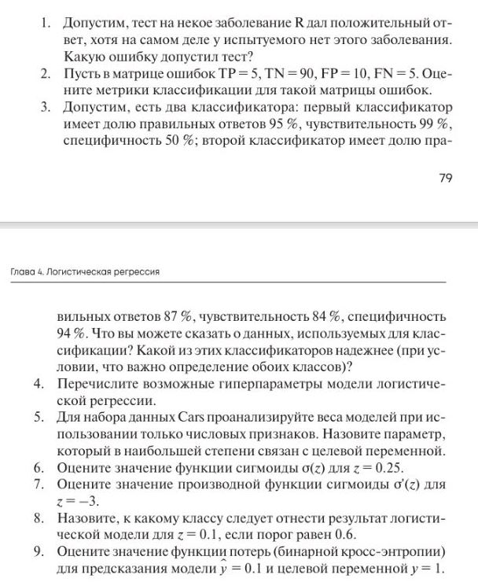

# Лабораторная работа 4
  

1.

В этом случае тест допустил ошибку, которая называется "ложноположительный результат".   
Это происходит, когда тест показывает положительный результат у здорового человека, т.е неправильно классифицирует отсутствие болезни как ее наличие. Это одна из двух основных ошибок в диагностических тестах, вторая - это "ложноотрицательный результат", когда тест не обнаруживает болезнь у действительно больного человека.

2.

Метрики классификации для следующей матрицы ошибок:
TP = 5, TN = 90, FP = 10, FN = 5
- Чувствительность (Sensitivity, Recall): TP / (TP + FN) = 5 / (5 + 5) = 0.5  
- Специфичность (Specificity): TN / (TN + FP) = 90 / (90 + 10) = 0.9  
- Точность (Accuracy): (TP + TN) / (TP + TN + FP + FN) = (5 + 90) / 100 = 0.95  
- F-мера (F1-score) = 2 (Precision Recall) / (Precision + Recall) = 2 (0.33 0.5) / (0.33 + 0.5) = 0.4

3.

Первый классификатор имеет высокую долю правильных ответов (95%), но низкую специфичность (50%). Это говорит нам о том, что данные не сбалансированные, то есть один из классов представлен значительно больше, чем другой.  
Второй классификатор имеет более сбалансированные показатели: средняя доля правильных ответов (87%), высокая чувствительность (84%) и специфичность (94%), это говорит нам о более качественных используемых данных.  
Таким образом, при условии, что важно корректное определение обоих классов, второй классификатор является более надежным выбором, поскольку он демонстрирует более сбалансированные показатели качества классификации.   

4.

Основные гиперпараметры логистической регрессии:

- Коэффициент регуляризации (C или лямбда)
- Тип регуляризации (L1, L2)
- Метод оптимизации
- Критерий остановки
- Пороговое значение для классификации
- Весовые коэффициенты классов
- Предобработка данных
- Выбор признаков
- Параметры предварительной обработки данных

5.
```
import pandas as pd
from sklearn.linear_model import LogisticRegression
from sklearn.model_selection import train_test_split

# Загрузка данных
data = pd.read_csv('cars.csv')

# Выделение числовых признаков
num_features = data.select_dtypes(include='number').columns

# Разделение данных на обучающую и тестовую выборки
X_train, X_test, y_train, y_test = train_test_split(data[num_features], data['target'], test_size=0.2, random_state=42)

# Построение модели логистической регрессии
model = LogisticRegression()
model.fit(X_train, y_train)

# Анализ весов моделей
coefs = model.coef_[0]
max_coef_idx = coefs.argmax()
print(f"Параметр с наибольшим весом: {num_features[max_coef_idx]}")
```
6.
```
import math

def sigmoid(z):
    return 1 / (1 + math.exp(-z))

z = 0.25
result = sigmoid(z)

print(f"Значение функции сигмоиды для z = {z} равно: {result:.4f}")
```
Значение функции сигмоиды для z = 0.25 равно: 0.5622

7.

```
import math

def sigmoid(z):
    return 1 / (1 + math.exp(-z))

def sigmoid_derivative(z):
    return sigmoid(z) * (1 - sigmoid(z))

z = -3
result = sigmoid_derivative(z)

print(f"Значение производной функции сигмоиды σ'(z) для z = {z} равно: {result:.6f}")
```
Значение производной функции сигмоиды σ'(z) для z = -3 равно: 0.045177

8.

Для того, чтобы определить, к какому классу следует отнести результат логистической модели нужно вычислить значение функции сигмоиды для z = 0.1 и сравнить его с пороговым значением.

Функция сигмоиды определяется как:  
o(z) = 1 / (1 + e^(-z))  

Для z = 0.1, значение функции сигмоиды будет:  
o(0.1) = 1 / (1 + e^(-0.1))  = 1 / (1 + 0.9048)  
= 0.5249  

Далее сравниваем значение функции сигмоиды с пороговым значением:  
0.5249 < 0.6  
класс).  

В итоге, при пороговом значении 0.6, результат логистической модели для z = 0.1 следует отнести к классу 0 (отрицательный класс).  

9.

Будем использовать формулу:  
L(y, p) = -[y * log(p) + (1 - y) * log(1 - p)]
y = 1 (целевая переменная)
p = 0.1 (предсказание модели)
подставим эти значения в формулу:

L(1, 0.1) = -[1 * log(0.1) + (1 - 1) * log(1 - 0.1)]
= -[1 * log(0.1) + 0 * log(0.9)]
= -log(0.1)

log(0.1) ≈ -2.30258509
-log(0.1) ≈ 2.30258509
Ответ: 2.3026
При помощи python:  
```
import math

y = 1  # целевая переменная
p = 0.1  # предсказание модели

loss = -y * math.log(p) - (1 - y) * math.log(1 - p)
print(f"Ответ: {loss:.6f}")
```
Ответ: 2.302585
