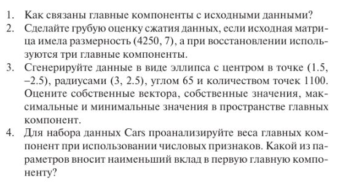

# Лабораторная работа 5
   

1.  

Главные компоненты связаны с исходными данными через линейные преобразования. Они представляют собой новые координатные оси, которые являются линейными комбинациями исходных признаков и максимизируют объясненную дисперсию данных.

2.

```
# Используем библиотеку numpy для работы с массивами данных
import numpy as np

# Размерность исходной матрицы
original_shape = (4250, 7)

# Количество главных компонент
n_components = 3

# Расчет количества элементов в исходной матрице
original_elements = np.prod(original_shape)

# Расчет количества элементов после PCA
pca_elements = original_shape[0] * n_components + n_components * original_shape[1]

# Расчет коэффициента сжатия
compression_ratio = pca_elements / original_elements

# Расчет процента сжатия
compression_percentage = (1 - compression_ratio) * 100

print(f"Исходное количество элементов: {original_elements}")
print(f"Количество элементов после PCA: {pca_elements}")
print(f"Коэффициент сжатия: {compression_ratio:.3f}")
print(f"Процент сжатия: {compression_percentage:.2f}%")
```
Исходное количество элементов: 29750  
Количество элементов после PCA: 12771  
Коэффициент сжатия: 0.429  
Процент сжатия: 57.07%  

3.

```
import numpy as np

# параметры эллипса и поворота
rx, ry = 3.0, 2.5
angle = np.deg2rad(65)

# генерируем углы и создаем эллипс
theta = np.linspace(0, 2*np.pi, 1100)
x = rx * np.cos(theta)
y = ry * np.sin(theta)

# поворачиваем и смещаем эллипс
X = np.array([x * np.cos(angle) - y * np.sin(angle) + 1.5, x * np.sin(angle) + y * np.cos(angle) - 2.5]).T

# вычитаем среднее значение
X_centered = X - np.mean(X, axis=0)

# вычисляем матрицу ковариации
cov_matrix = np.cov(X_centered, rowvar=False)

# вычисляем собственные вектора и значения
eigenvalues, eigenvectors = np.linalg.eig(cov_matrix)

print("Собственные вектора:\n", eigenvectors)
print("Собственные значения:\n", eigenvalues)

# преобразуем данные в пространство главных компонент
X_pca = np.dot(X_centered, eigenvectors)

# выводим максимальные и минимальные значения
print("Максимальные значения:\n", np.max(X_pca, axis=0))
print("Минимальные значения:\n", np.min(X_pca, axis=0))
```
Собственные вектора:  
 [[-0.90630779 -0.42261826]  
 [ 0.42261826 -0.90630779]]  
Собственные значения:  
 [3.125      4.50818182]  
Максимальные значения:  
 [2.49999745 3.00271502]  
Минимальные значения:  
 [-2.49999745 -2.99727273]  

 4.
