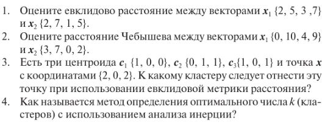

# Лабораторная работа 6


1.  

Для оценки евклидова расстояния между векторами x1 = (2, 5, 3, 7) и x2 = (2, 7, 1, 5), мы можем использовать формулу евклидова расстояния:  

d = √[(x1₁ - x2₁)² + (x1₂ - x2₂)² + (x1₃ - x2₃)² + (x1₄ - x2₄)²]  
Вычислим разности между соответствующими координатами:  
(2 - 2) = 0  
(5 - 7) = -2  
(3 - 1) = 2  
(7 - 5) = 2  
Возведем эти разности в квадрат:  
0² = 0  
(-2)² = 4  
2² = 4  
2² = 4  
Сложим квадраты разностей:  
0 + 4 + 4 + 4 = 12  
Извлечем квадратный корень из суммы:  
√12 ≈ 3.464  
Итого евклидово расстояние между векторами x1 и x2 приблизительно равно 3.464
```
import numpy as np

x1 = np.array([2, 5, 3, 7])
x2 = np.array([2, 7, 1, 5])

distance = np.linalg.norm(x1 - x2)
print(f"Евклидово расстояние: {distance:.3f}")
```
Евклидово расстояние: 3.464  

2.

```
import numpy as np

x1 = np.array([0, 10, 4, 9])
x2 = np.array([3, 7, 0, 2])

chebyshev_distance = np.max(np.abs(x1 - x2))
print(f"Расстояние Чебышева: {chebyshev_distance}")
```
Расстояние Чебышева: 7  

3.  

```
import numpy as np

# Определить центроиды и точку
c1 = np.array([1, 0, 0])
c2 = np.array([0, 1, 1])
c3 = np.array([1, 0, 1])
x = np.array([2, 0, 2])

# Вычислить евклидово расстояние между x и каждым центроидом
dist_c1 = np.linalg.norm(x - c1)
dist_c2 = np.linalg.norm(x - c2)
dist_c3 = np.linalg.norm(x - c3)

# Определить к какому центроиду x ближе всего
closest_centroid = np.argmin([dist_c1, dist_c2, dist_c3]) + 1

print(f"Точка x должна быть отнесена к кластеру, связанному с центроидом c{closest_centroid}")
```
Точка x должна быть отнесена к кластеру, связанному с центроидом c3 

4.

Метод определения оптимального числа кластеров с использованием анализа инерции называется "Метод локтя" или "Elbow Method". Этот метод основан на визуализации изменения значения инерции (внутригрупповой суммы квадратов) в зависимости от числа кластеров k. "Локоть" на графике, то есть точка, после которой увеличение числа кластеров не приводит к значительному уменьшению инерции, указывает на оптимальное число кластеров.  
